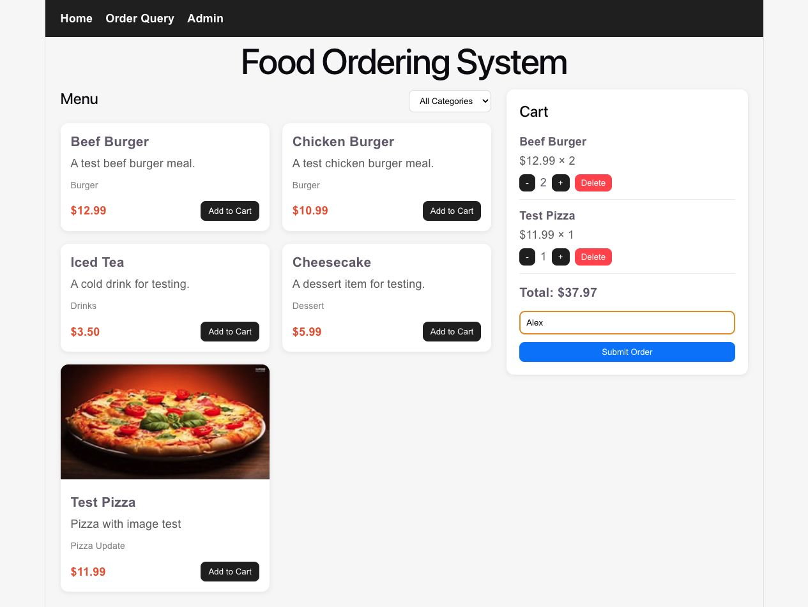
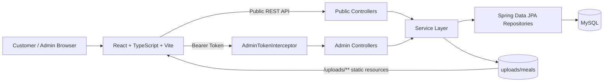
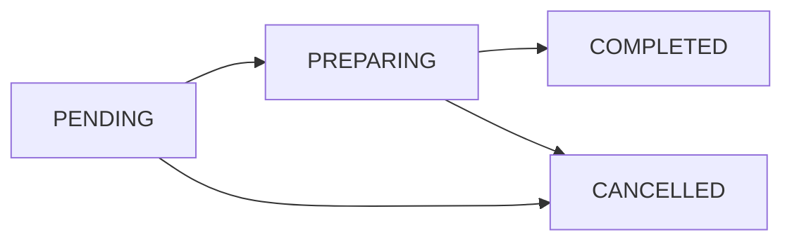

<div align="center">

# 🍽️ Food Ordering System

**A full-stack restaurant ordering application covering customer ordering, order tracking, admin order processing, and menu management.**

<p>
  
  
  
  
  
  
</p>

[Preview](#-project-preview) · [Features](#-features) · [Quick Start](#-quick-start) · [API](#-api-overview) · [Troubleshooting](#-troubleshooting)

</div>

---

## 📖 Overview

Food Ordering System is a full-stack, decoupled web application with complete customer and administrator workflows:

- Customers can browse and filter meals, manage a cart, submit orders, and track order status by ID.
- Administrators use a two-step entry-code and account login flow to manage orders, categories, meals, and meal images.
- The backend validates prices, calculates totals, controls order-state transitions, authenticates administrators, and stores uploaded images.

The project is suitable as a React and Spring Boot learning project, a course assignment, or a REST API layered-architecture example.

## 📸 Project Preview

<p align="center">
  
</p>

<p align="center"><sub>Customer ordering page captured from the application running locally with the frontend, backend, and MySQL connected.</sub></p>

| Area | Runtime behavior |
| --- | --- |
| **Category filter** | The dropdown switches between all meals and a selected category, requesting the corresponding menu data from the backend. |
| **Meal cards** | Each card displays a name, description, category, price, and optional image. `Add to Cart` adds the meal to the current cart. |
| **Shopping cart** | Customers can increase quantities, decrease quantities, remove items, and see the total update immediately. |
| **Order submission** | After the customer enters a name and confirms, the backend creates the order using the latest prices stored in the database. |

> The meals, image, and prices shown above came from the connected MySQL database rather than static placeholder content.

## ✨ Features

| Role | Module | Implemented capabilities |
| --- | --- | --- |
| Customer | Menu | View meal images, names, descriptions, categories, and prices; filter meals by category |
| Customer | Cart | Add meals, change quantities, remove items, and calculate the total automatically |
| Customer | Orders | Submit an order, receive an order ID, and query order status and line items |
| Administrator | Authentication | Entry-code verification, account login, Bearer token authentication, and logout |
| Administrator | Order management | View all orders, filter by status, and apply valid status transitions |
| Administrator | Menu management | Create, update, and delete meal types and meals; preview and upload images |

### Implementation Highlights

- **Server-side pricing:** order requests contain only meal IDs and quantities. The backend reloads each meal and calculates the total from database prices.
- **Historical price snapshots:** every `OrderItem` stores its `itemPrice`, so later menu-price changes do not alter previous orders.
- **Controlled status transitions:** the backend validates every transition; completed and cancelled orders cannot be changed again.
- **Layered architecture:** Controller, Service, Repository, DTO, and Entity responsibilities are separated.
- **Centralized error handling:** unauthorized access, missing resources, invalid input, and other errors use shared exception handling.
- **Separated image storage:** image files are stored on disk while the database stores only their public paths.

## 🏗️ Architecture



### Administrator Authentication Flow

```text
Entry-code check → Account login → Backend generates a UUID token
                 → Frontend stores it in localStorage
                 → Authorization: Bearer <token>
                 → Interceptor protects /api/admin/**
```

Administrator tokens are stored in backend memory and are not JWTs. The default lifetime is `120` minutes. Restarting the backend invalidates all existing tokens, so administrators must sign in again.

### Meal Image Flow

```text
Local browser preview → multipart/form-data upload → Backend image validation
                      → Save under uploads/meals
                      → Store /uploads/meals/... path in MySQL
```

The default maximum file size and request size are both `5 MB`. Start the backend from `Backend/Backend` so the relative upload directory remains consistent.

## 🧰 Technology Stack

| Layer | Technologies |
| --- | --- |
| Frontend | React 19.2, TypeScript 6, React Router 7, Vite 8, Fetch API, plain CSS |
| Backend | Java 17, Spring Boot 4.0.6, Spring WebMVC, Spring Validation, Spring Data JPA |
| Database | MySQL |
| Tooling | npm, Maven Wrapper, Lombok |
| File storage | Local backend directory at `uploads/meals/` |

## 🚀 Quick Start

### 1. Prerequisites

| Tool | Requirement |
| --- | --- |
| Java | 17 or later |
| Node.js | `^20.19.0` or `>=22.12.0` |
| npm | Installed with Node.js |
| MySQL | A locally accessible MySQL Server |
| Maven | No separate installation required; Maven Wrapper is included |

Check the installed versions:

```bash
java -version
node -v
npm -v
mysql --version
```

### 2. Clone the Repository

```bash
git clone https://github.com/YujieLiang02/Food_Ordering_System.git
cd Food_Ordering_System
```

### 3. Create the Database

Sign in to MySQL:

```bash
mysql -u root -p
```

Create the database:

```sql
CREATE DATABASE IF NOT EXISTS Food_Ordering_System
  CHARACTER SET utf8mb4
  COLLATE utf8mb4_unicode_ci;
```

The project uses `spring.jpa.hibernate.ddl-auto=update`, so the backend creates or updates the tables when it starts. It does not create the database itself.

> The repository does not include seed data. An empty menu is expected on the first run; sign in to the admin area and create meal types and meals first.

### 4. Configure the Backend

Setting environment variables in the same terminal that starts the backend is recommended, because it keeps real credentials out of the repository:

```bash
export DB_URL='jdbc:mysql://localhost:3306/Food_Ordering_System?useSSL=false&serverTimezone=UTC&allowPublicKeyRetrieval=true'
export DB_USERNAME='root'
export DB_PASSWORD='your_mysql_password'

export ADMIN_ENTRY_CODE='your_admin_entry_code'
export ADMIN_USERNAME='admin'
export ADMIN_PASSWORD='your_admin_password'
export ADMIN_TOKEN_EXPIRE_MINUTES='120'
```

PowerShell example:

```powershell
$env:DB_USERNAME = "root"
$env:DB_PASSWORD = "your_mysql_password"
$env:ADMIN_USERNAME = "admin"
$env:ADMIN_PASSWORD = "your_admin_password"
```

Alternatively, use `Backend/Backend/src/main/resources/application-example.properties` as a reference and fill in the values manually. Spring Boot does not automatically load a regular `.env` file.

### 5. Start the Backend

macOS / Linux:

```bash
cd Backend/Backend
chmod +x mvnw
./mvnw spring-boot:run
```

Windows:

```bat
cd Backend\Backend
mvnw.cmd spring-boot:run
```

The backend runs at `http://localhost:8080` by default. Check the public API with:

```bash
curl http://localhost:8080/api/meal-types
```

A successful request returns a JSON array. Before any categories have been created, the usual response is `[]`.

### 6. Start the Frontend

Open another terminal:

```bash
cd Frontend/food-ordering-frontend
npm ci
cp .env.example .env
npm run dev
```

The frontend environment file should contain:

```env
VITE_API_BASE_URL=http://localhost:8080
```

Open the application at:

```text
http://localhost:5173
```

> The current backend CORS configuration allows only `http://localhost:5173`. Use `localhost` rather than `127.0.0.1`. If the frontend port or production domain changes, update `CorsConfig.java` as well.

## 🧭 First-Run Walkthrough

1. Open `/admin` and enter the configured administrator entry code.
2. Sign in with the configured administrator username and password.
3. Open menu management, create a meal type, then create a meal and upload an image.
4. Return to the customer home page, add meals to the cart, and submit an order.
5. Save the order ID returned by the application.
6. Open `/orders/query` and enter the order ID to view its details and current status.
7. In the admin dashboard, move the order from `PENDING` to `PREPARING`, then complete or cancel it.

## 🗺️ Application Routes

| Route | Page | Purpose |
| --- | --- | --- |
| `/` | `HomePage` | Menu browsing, category filtering, cart management, and order submission |
| `/orders/query` | `OrderQueryPage` | Look up order status and details by order ID |
| `/admin` | `AdminLoginPage` | Administrator entry-code check and account login |
| `/admin/dashboard` | `AdminDashboardPage` | Order list, status filtering, and status updates |
| `/admin/menu` | `AdminMenuPage` | Meal type, meal, and image management |

## 🔄 Order Status Rules



| Current status | Allowed next status | Meaning |
| --- | --- | --- |
| `PENDING` | `PREPARING`, `CANCELLED` | A new order can begin preparation or be cancelled |
| `PREPARING` | `COMPLETED`, `CANCELLED` | An order in preparation can be completed or cancelled |
| `COMPLETED` | None | Final state; no further updates are accepted |
| `CANCELLED` | None | Final state; no further updates are accepted |

## 🔌 API Overview

### Public Endpoints

| Method | Path | Purpose |
| --- | --- | --- |
| `GET` | `/api/meal-types` | Get all meal types |
| `GET` | `/api/meal-types/{id}` | Get one meal type |
| `GET` | `/api/meals` | Get all meals |
| `GET` | `/api/meals/{id}` | Get one meal |
| `GET` | `/api/meals/type/{mealTypeId}` | Get meals by type |
| `POST` | `/api/orders` | Create an order |
| `GET` | `/api/orders/{id}` | Get an order by ID |

### Administrator Endpoints

Every request except the entry-code check and login must include `Authorization: Bearer <token>`.

| Method | Path | Purpose |
| --- | --- | --- |
| `POST` | `/api/admin/entry/check` | Validate the administrator entry code |
| `POST` | `/api/admin/login` | Sign in and obtain a token |
| `POST` | `/api/admin/logout` | Sign out and remove the token |
| `GET` | `/api/admin/orders` | Get all orders |
| `GET` | `/api/admin/orders/{id}` | Get one order |
| `GET` | `/api/admin/orders/status/{status}` | Filter orders by status |
| `PATCH` | `/api/admin/orders/{id}/status` | Update an order status |
| `DELETE` | `/api/admin/orders/{id}` | Delete an order; the current admin UI has no button for this endpoint |
| `GET / POST` | `/api/admin/meals` | List or create meals |
| `GET / PUT / DELETE` | `/api/admin/meals/{id}` | Read, update, or delete one meal |
| `GET` | `/api/admin/meals/type/{mealTypeId}` | Get meals by type |
| `POST` | `/api/admin/meals/{id}/image` | Upload a meal image |
| `GET / POST` | `/api/admin/meal-types` | List or create meal types |
| `GET / PUT / DELETE` | `/api/admin/meal-types/{id}` | Read, update, or delete one meal type |

## 📁 Project Structure

```text
Food_Ordering_System/
├── Backend/Backend/
│   ├── src/main/java/com/yujie/backend/
│   │   ├── config/          # CORS, interceptors, and static-resource configuration
│   │   ├── controller/      # Public and administrator endpoints
│   │   ├── dto/             # Request and response structures
│   │   ├── entity/          # JPA entities
│   │   ├── exception/       # Centralized exception handling
│   │   ├── repository/      # Data-access layer
│   │   ├── service/         # Business logic
│   │   └── util/            # Administrator token utility
│   ├── src/main/resources/  # Spring Boot configuration
│   ├── uploads/meals/       # Locally uploaded meal images
│   ├── pom.xml
│   └── mvnw
├── Frontend/food-ordering-frontend/
│   ├── src/
│   │   ├── api/             # Fetch API wrappers
│   │   ├── pages/           # Customer and administrator pages
│   │   ├── types/           # TypeScript types
│   │   ├── App.tsx          # Application routes
│   │   └── App.css          # Application styles
│   ├── .env.example
│   └── package.json
├── docs/screenshots/        # README runtime screenshots
└── README.md
```

## ✅ Build and Checks

Frontend:

```bash
cd Frontend/food-ordering-frontend
npm run lint
npm run build
```

Backend:

```bash
cd Backend/Backend
./mvnw test
./mvnw clean package
```

> The backend currently contains one `contextLoads` smoke test and loads the real datasource. MySQL, the database, and the environment configuration must therefore be available before running the test. The frontend currently has no automated test script.

## 🧯 Troubleshooting

<details>
<summary><strong>The frontend cannot reach the backend</strong></summary>

- Confirm that the backend is running at `http://localhost:8080`.
- Confirm that `VITE_API_BASE_URL` is correct in the frontend `.env` file.
- Restart Vite after changing `.env`.
- Remember that the current CORS configuration allows only `http://localhost:5173`.

</details>

<details>
<summary><strong>The customer menu is empty</strong></summary>

The project does not include seed data. Sign in to the admin area, create a meal type and one or more meals, then return to the customer home page.

</details>

<details>
<summary><strong>MySQL connection fails</strong></summary>

Check the MySQL service, database name, username, password, and `DB_URL`. Use `mysql -u root -p` to verify the local database connection first.

</details>

<details>
<summary><strong>An uploaded image does not appear</strong></summary>

- Start the backend from `Backend/Backend`.
- Check that the file exists under `Backend/Backend/uploads/meals/`.
- Check that `meal.image_url` contains a `/uploads/meals/...` path.
- Confirm that the image does not exceed `5 MB`.

</details>

<details>
<summary><strong>Admin requests become unauthorized after a backend restart</strong></summary>

Administrator tokens are stored in backend memory. Restarting the backend invalidates existing tokens; sign out and sign in again.

</details>

<details>
<summary><strong>A meal type or meal cannot be deleted</strong></summary>

A meal type that is still referenced by meals, or a meal referenced by historical order items, may be protected by database foreign-key constraints. Review the related records before deleting them.

</details>

## 🔭 Possible Improvements

- Responsive mobile layout
- Meal search, pagination, and availability controls
- Password hashing and persistent administrator sessions
- Inventory, payment, and delivery workflows
- Frontend and backend automated tests with CI
- Docker Compose and production deployment configuration

---

<div align="center">

Made with ☕ by **Yujie Liang**

</div>
